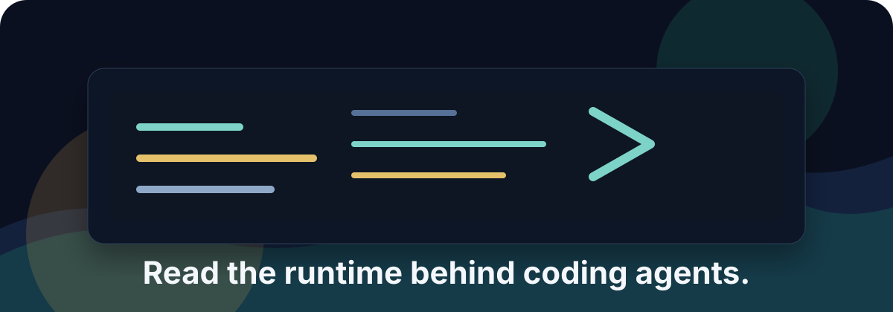
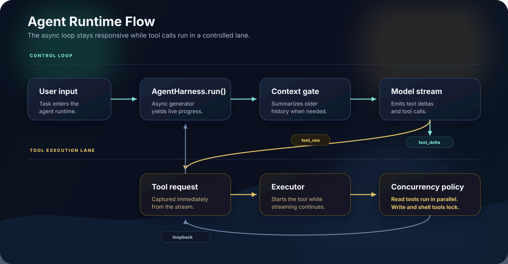

<p align="center">
  
</p>

<h1 align="center">Minimal Agent Harness</h1>

<p align="center">
  <strong>The coding-agent runtime, distilled into one readable Python file.</strong>
</p>

<p align="center">
  <a href="https://github.com/yo666666yo/minimal-agent-harness/stargazers"></a>
  <a href="https://github.com/yo666666yo/minimal-agent-harness/actions"></a>
  <a href="LICENSE"></a>
  <a href="https://www.python.org/"></a>
</p>

Most agent repos show you the product. This repo shows you the runtime.

`minimal-agent-harness` is a compact, runnable reference implementation of the loop behind coding agents: stream model events, start tools while the model is still streaming, gate risky tools behind approval, feed tool results back into the conversation, compact long context, and keep going until the task is done.

It is intentionally small enough to read in one sitting, but complete enough to teach the control flow that production agent systems hide behind layers of framework code.

---

## What It Teaches

**A real agent loop.** `AgentHarness.run()` is an async generator that emits structured `AgentEvent` objects for model deltas, tool calls, tool results, approval requests, compaction, aborts, and completion.

**Runtime control flow.** Callers can send `AgentCommand` objects back into the generator with `asend()`, so a CLI, TUI, web UI, or IDE plugin can approve tools or abort the active run.

**Streaming tool execution.** Tool calls begin as soon as the provider stream emits them. The harness does not wait for the full model message before starting safe work.

**Safe concurrency.** Read-only tools can run in parallel. Workspace-changing tools are exclusive, so side effects do not trample each other.

**Approval and hooks.** `ToolPolicy` is the decision point before execution; hooks observe emitted events without owning policy decisions.

**Session and context.** `AgentSession` preserves conversation history across user turns, and long histories are summarized into a compact prefix instead of being blindly truncated.

**Provider isolation.** Anthropic, OpenAI, mocks, MCP adapters, or your own endpoint fit behind the same tiny `APIClient` event interface.

---

## Quick Install

```bash
git clone https://github.com/yo666666yo/minimal-agent-harness.git
cd minimal-agent-harness
pip install anthropic
python agent_harness.py --mock
```

Mock mode needs no API key and still exercises the loop:

```text
> search for "Tool" in the codebase
[Agent] Starting with 4 tools, max 10 turns
[Turn 1/10]
[Agent] Calling model...
[Tool call] grep({"pattern": "Tool", "path": "."})
[Tool result/OK] ./agent_harness.py:...
```

For a real Anthropic model:

```bash
export ANTHROPIC_API_KEY=sk-ant-...
python agent_harness.py
```

---

## The Runtime In One Picture

<p align="center">
  
</p>

---

## Core Pieces

| Piece | File | Why it matters |
|---|---|---|
| `AgentEvent` / `render_event()` | `agent_harness.py` | Separates runtime events from display text |
| `AgentCommand` | `agent_harness.py` | Lets the caller approve tools or abort a run with `asend()` |
| `AgentSession` | `agent_harness.py` | Keeps conversation state across user turns |
| `Tool` / `ToolContext` | `agent_harness.py` | Gives tools input, abort signal, workspace root, and session access |
| `ToolCapabilities` | `agent_harness.py` | Describes read-only, concurrency, and approval behavior |
| `ToolPolicy` | `agent_harness.py` | Gates model-requested tool execution |
| `APIClient` | `agent_harness.py` | Normalizes provider streams into `text_delta`, `tool_use`, and `message_stop` |
| `StreamingToolExecutor` | `agent_harness.py` | Starts approved tools during model streaming |
| `summarize_conversation()` | `agent_harness.py` | Preserves task state when history gets long |
| `TraceContext` / `to_trace_dict()` | `agent_harness.py` | Adds the minimum rollout identity and provenance fields |

## Minimal Rollout Trace

The harness can emit a paper-aligned trace record for every runtime event while
keeping the existing `type` and `data` fields. Pass stable identifiers for a
rollout group and sample, plus any externally computed reward:

```python
async for event in harness.run(
    "solve the task",
    trace_id="trace-001",
    group_id="task-001",
    rollout_id="rollout-003",
    reward={"team": 1.0},
    provenance={"prompt_id": "prompt-001", "model": "frozen-model"},
):
    record = event.to_trace_dict()
```

Each traced record contains `trace_id`, `group_id`, `rollout_id`,
`event_type`, `agent`, `tool`, `reward`, and `provenance`. `event_type` maps
runtime events to the paper's event vocabulary (`model_delta` to `message`,
`run_complete` to `return`, and so on); the original runtime name remains in
`type` and `provenance.runtime_event`. Tool calls and results carry the tool
name. The supplied reward is written to the terminal event only, because the
harness does not infer evaluation outcomes.

---

## Built-In Tools

| Tool | Parallel? | Approval? | Purpose |
|---|---:|---:|---|
| `read_file` | Yes | No | Read workspace files or line ranges |
| `grep` | Yes | No | Search Python files under the workspace |
| `write_file` | No | Yes | Write workspace files |
| `bash` | No | Yes | Run shell commands with `workspace_root` as cwd |

The built-in file tools are guarded by `workspace_root`. This is not a sandbox; shell commands still run on your machine.

---

## Use It As A Library

```python
import asyncio

from agent_harness import AgentConfig, AgentHarness, MockAPIClient, render_event


async def main():
    harness = AgentHarness(MockAPIClient(), AgentConfig(max_turns=5))

    async for event in harness.run("Search for 'StreamingToolExecutor'"):
        print(render_event(event))


asyncio.run(main())
```

---

## Approval Flow

When a policy returns `request_approval`, the runtime yields an `approval_requested` event and pauses until the caller sends an `ApprovalResponse`.

```python
import asyncio

from agent_harness import (
    AgentConfig,
    AgentHarness,
    ApprovalResponse,
    MockAPIClient,
    RequireApprovalPolicy,
    render_event,
)


async def main():
    harness = AgentHarness(
        MockAPIClient(),
        AgentConfig(tool_policy=RequireApprovalPolicy()),
    )
    stream = harness.run("write a small file")

    command = None
    while True:
        try:
            if command is None:
                event = await stream.__anext__()
            else:
                event = await stream.asend(command)
                command = None
        except StopAsyncIteration:
            break

        print(render_event(event))

        if event.type == "approval_requested":
            command = ApprovalResponse(event.data["request_id"], approved=False)


asyncio.run(main())
```

---

## Extend It

```python
from typing import Any

from agent_harness import Tool, ToolCapabilities, ToolContext


class TicketLookupTool(Tool):
    name = "ticket_lookup"
    description = "Look up an internal ticket by ID."
    input_schema = {
        "type": "object",
        "properties": {"ticket_id": {"type": "string"}},
        "required": ["ticket_id"],
    }
    capabilities = ToolCapabilities(read_only=True, concurrency_safe=True)

    async def call(self, input: dict[str, Any], context: ToolContext) -> str:
        return f"Ticket {input['ticket_id']}: example result"
```

Examples:

- [`examples/custom_tool.py`](examples/custom_tool.py) - add a small domain tool.
- [`examples/openai_client.py`](examples/openai_client.py) - adapt the harness to OpenAI's Responses API.
- [`examples/approval_policy.py`](examples/approval_policy.py) - drive the bidirectional approval protocol.
- [`examples/jsonl_transcript.py`](examples/jsonl_transcript.py) - write structured events to JSONL from a hook.
- [`examples/mcp_adapter.py`](examples/mcp_adapter.py) - sketch how MCP tools fit behind the `Tool` interface.

---

## Project Map

```text
agent_harness.py              # the readable core runtime
examples/
  approval_policy.py          # bidirectional approval example
  custom_tool.py              # custom tool example
  jsonl_transcript.py         # hook-based JSONL transcript example
  mcp_adapter.py              # minimal MCP-to-Tool adapter sketch
  openai_client.py            # optional OpenAI provider adapter
tests/
  test_agent_harness.py       # focused regression tests
  test_minimal_mas.py         # two-agent environment and credit smoke tests
.github/workflows/ci.yml      # pytest + ruff
```

## Minimal Two-Agent Experiment

The `experiments/` package contains a synthetic coordinator/researcher task with parallel reads, serialized writes, and a held-out comparison of single-agent, naive GRPO, and CAD-GRPO. It is intentionally model-free: use it to validate the rollout schema, scheduler, cost counters, and credit/oracle metric before connecting a provider.

```powershell
python -m experiments.minimal_mas --train-groups 24 --group-size 8 --eval-rollouts 128
```

See [`experiments/README.md`](experiments/README.md) for the metric contract and limitations.

---

## Good Fit / Bad Fit

| Use case | Fit |
|---|---|
| Learn how coding-agent loops work | Excellent |
| Teach event streams, approval, hooks, sessions, and compaction | Excellent |
| Prototype a narrow custom agent runtime | Good |
| Replace LangChain, AutoGen, or a production platform | Poor |
| Run untrusted shell commands safely | Poor |

---

## Roadmap

- Provider examples for Gemini and LiteLLM.
- Better sandbox examples for shell and file tools.
- A terminal recording for the README.
- More precise token accounting.
- Walkthrough docs for the executor, compacting, provider adapter, and approval flow.

---

## Contributing

Contributions are welcome when they keep the core easy to read. Start with [`CONTRIBUTING.md`](CONTRIBUTING.md), run `pytest -q`, and keep provider-specific complexity in `examples/` unless it belongs in the runtime itself.

## Security

This harness includes local filesystem and shell tools for teaching purposes. It is not a sandbox. Do not expose the built-in tools to untrusted users. See [`SECURITY.md`](SECURITY.md).

## License

MIT - see [`LICENSE`](LICENSE).
